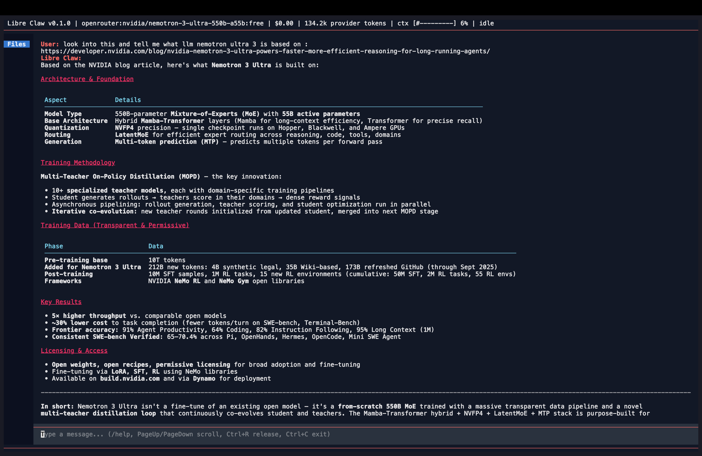
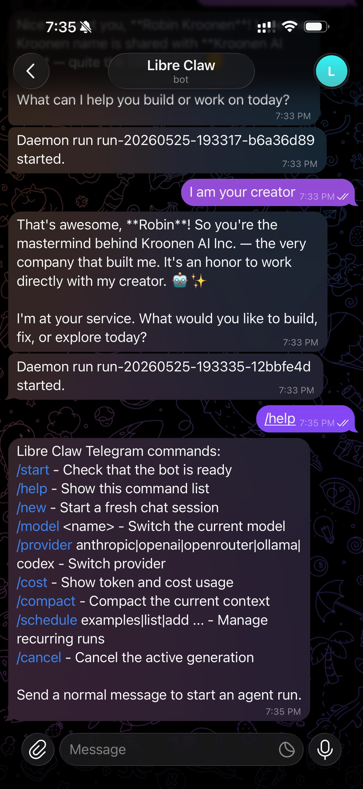

# Libre Claw

Libre Claw is a terminal-native autonomous coding agent harness built by
[Kroonen AI](https://kroonen.ai). It gives you a serious local TUI,
Telegram control, durable runs, persistent memory, browser tools, scheduled
tasks, and multi-provider model routing in one Python application.

It is built for developers who want an agent that can actually work in a
project, ask before side effects, remember useful context, and keep running
when the terminal closes.

Current release: Version `0.1.0`.



## Highlights

| Capability | What it means |
| --- | --- |
| Terminal UI | Streaming chat, file explorer, command palette, approvals, run timeline, and artifacts. |
| Telegram bridge | Talk to the same agent from Telegram, approve tools inline, and receive scheduled reports. |
| Durable runs | Every task gets a run ID, JSONL event log, summary, verification notes, and optional diff. |
| Local dashboard | Start, inspect, cancel, and approve daemon-owned runs from a browser on localhost. |
| Memory and skills | Local persistent memory, `soul.md` persona files, and user/project `SKILL.md` workflows. |
| Real tools | File edits, shell, search, git, HTTP requests, browser actions, screenshots, MCP tools, and more. |
| Provider routing | OpenRouter, Ollama/Ollama Cloud, Anthropic, OpenAI, Codex OAuth, and local-compatible endpoints. |
| Safe defaults | API keys stay out of project config, dangerous commands are blocked, and writes require approval. |

## Install

Recommended local install:

```bash
git clone https://github.com/kroonen-ai/libre-claw.git
cd libre-claw
python3 -m venv .venv
source .venv/bin/activate
python -m pip install --upgrade pip
python -m pip install -e ".[dev]"
```

One-command installer:

```bash
curl -fsSL https://raw.githubusercontent.com/kroonen-ai/libre-claw/main/scripts/install.sh | sh
```

For browser tools:

```bash
python -m pip install -e ".[browser]"
python -m playwright install chromium
```

## First Run

Start the TUI:

```bash
libre-claw
```

Equivalent entrypoints:

```bash
libre-claw tui
libre-claw chat
python -m libre_claw
```

Inside the app, run:

```text
/setup status
/setup provider openrouter
/setup key openrouter
/model openrouter:openrouter/auto --global
```

The `--global` flag saves the selected provider/model to
`~/.libre-claw/config.toml`.

## Provider Setup

Libre Claw does not need real API keys in project files. Use the key store:

```bash
libre-claw auth set-key openrouter
libre-claw auth set-key anthropic
libre-claw auth set-key openai
libre-claw auth set-key ollama
libre-claw auth status
```

Or use environment variables:

```bash
export OPENROUTER_API_KEY="..."
export ANTHROPIC_API_KEY="..."
export OPENAI_API_KEY="..."
export OLLAMA_API_KEY="..."
```

Key lookup order:

1. Environment variable.
2. OS keyring.
3. Encrypted local fallback file at `~/.libre-claw/.keys`.

### Common Model Commands

```text
/model list
/model openrouter:qwen/qwen3.7-max --global
/model openrouter:deepseek/deepseek-v4-flash --global
/model ollama:kimi-k2.6:cloud --global
/model anthropic:claude-opus-4-7 --global
/model openai:gpt-5.5 --global
/model codex:gpt-5.5 --global
```

Use `/provider` when you only want to switch providers:

```text
/provider openrouter
/provider ollama
/provider anthropic
/provider openai
/provider codex
```

### Codex / ChatGPT Login

Codex uses the supported Codex CLI login flow instead of an OpenAI API key:

```bash
libre-claw auth codex-login
```

Or inside the TUI:

```text
/codex login
/provider codex
/model codex:gpt-5.5 --global
```

## Run Surfaces

### TUI

```bash
libre-claw tui
```

Best for interactive coding, approvals, file browsing, artifacts, and local
work.

### Daemon And Dashboard

```bash
libre-claw daemon
```

Open:

```text
http://127.0.0.1:8766/dashboard
```

The daemon owns active runs, keeps them alive after the TUI exits, exposes a
local dashboard, supervises schedules, and can start Telegram automatically
when Telegram is enabled and a stored bot token exists.

### Telegram

```bash
libre-claw telegram setup --user-id 123456789
libre-claw telegram up
```

Telegram uses your numeric Telegram user ID, not your `@username`. If you are
blocked, the bot replies with the exact allow command to run.

Useful Telegram commands:

```text
/start
/help
/new
/model
/models
/provider
/cost
/status
/compact
/schedule
/cancel
```



## What The Agent Can Do

Libre Claw ships with production-oriented tools for:

- Reading, writing, editing, searching, and listing project files.
- Running shell commands with timeout, truncation, and permission checks.
- Inspecting git status and creating commits with approval.
- Making direct HTTP requests for APIs and downloads.
- Browsing pages with persistent Playwright profiles.
- Clicking, typing, waiting, extracting page data, dismissing cookie banners,
  taking screenshots, and saving downloads.
- Calling configured MCP tools through the same permission system.

Write/edit/shell/browser action tools ask first. Read-only tools are allowed by
default.

## Core Workflows

### Durable Runs

Every user task gets a run under:

```text
~/.libre-claw/runs/<run-id>/
```

Each run can include:

- `events.jsonl`
- `summary.md`
- `verification.md`
- `diff.patch`
- browser artifacts
- tool and permission events

Useful commands:

```text
/runs
/run <id>
/resume <id>
/cancel <id>
/artifacts summary <id>
/changes <id>
/approvals
```

### Persistent Memory

Libre Claw stores local memory in three layers:

- Raw session archives in `~/.libre-claw/sessions/`.
- Durable run archives in `~/.libre-claw/runs/`.
- Searchable memory items in `~/.libre-claw/memory.db`.

It can automatically extract durable facts, preferences, project decisions, and
workflow summaries after completed runs. Credential-looking data is redacted
before indexing or injection.

Useful commands:

```text
/memory status
/memory list
/memory search <query>
/memory add <text>
/memory forget <id>
/memory summarize
/memory on
/memory off
```

### Skills And Persona

Libre Claw loads reusable skills from:

```text
~/.libre-claw/skills/
<project>/.libre-claw/skills/
```

AgentSkills-style packages with `SKILL.md` are supported.

Persona files are loaded from:

```text
~/.libre-claw/soul.md
<project>/.libre-claw/soul.md
<project>/soul.md
```

Useful commands:

```text
/skills list
/skills show <name>
/skills add --project <name>
/soul status
/soul init --project
/soul show
```

### Scheduled Work And Heartbeats

Create recurring local runs:

```text
/schedule examples
/schedule add daily 09:00 | Daily repo health check | Inspect git status, tests, and risks.
/schedule list
/schedule pause <id>
/schedule resume <id>
```

Start lightweight periodic check-ins:

```text
/heartbeat status
/heartbeat once
/heartbeat start every 30 minutes
/heartbeat stop
```

### Goal Mode

Use `/goal` for bounded autopilot work:

```text
/goal Fix the failing tests and explain the result
```

Libre Claw runs a normal agent turn, asks a separate judge model whether the
goal is complete, then continues until the judge marks it done or the turn
limit is reached.

## Important Slash Commands

```text
/help
/clear
/cancel
/exit
/cost
/compact
/model [provider:]<model> [--global]
/provider <name>
/setup status
/tools list
/runs
/memory status
/skills list
/workspace status
/telegram
```

Keybindings:

- `Ctrl+B`: toggle file explorer.
- `Ctrl+P`: command palette.
- `Ctrl+Shift+C`: copy last assistant response.
- `Esc`: cancel active generation/tool execution.
- `Ctrl+C`: exit the app.
- `Tab`: accept the first slash-command suggestion.

## Configuration

Main config:

```text
~/.libre-claw/config.toml
```

Show bundled defaults:

```bash
libre-claw config defaults
```

Common environment overrides:

```bash
LIBRE_CLAW_DEFAULT_PROVIDER=openrouter
LIBRE_CLAW_DEFAULT_MODEL=openrouter/auto
LIBRE_CLAW_WORKING_DIRECTORY=/path/to/project
```

Initialize a dedicated workspace:

```bash
libre-claw workspace init
```

By default, this creates:

```text
~/Documents/.workspace/libre-claw
```

## Safety Model

Libre Claw is powerful because it can touch your files, shell, browser, and git
history. The default posture is local-first and permissioned:

- API keys are read from environment variables, keyring, or encrypted local
  fallback storage.
- Provider keys are not written to project config files.
- File writes, edits, shell commands, browser navigation/actions, downloads,
  git commits, and MCP actions ask for approval.
- Dangerous shell patterns are blocked by the sandbox layer.
- File access is restricted to the configured working directory by default.
- Memory redacts credential-looking strings before indexing or prompt
  injection.
- Runs are append-only and inspectable through JSONL logs and artifacts.

## Troubleshooting

### macOS says `externally-managed-environment`

Use a virtual environment:

```bash
python3 -m venv .venv
source .venv/bin/activate
python -m pip install -e ".[dev]"
```

### Missing API key

```bash
libre-claw auth status
libre-claw auth set-key openrouter
```

Replace `openrouter` with `anthropic`, `openai`, or `ollama`. For Codex:

```bash
libre-claw auth codex-login
```

### Ollama Cloud returns 401

Make sure you stored the real Ollama API key, not the model name:

```bash
libre-claw auth set-key ollama
```

For direct Ollama Cloud API use:

```toml
[providers.ollama]
base_url = "https://ollama.com"
api_format = "ollama"
api_key_env = "OLLAMA_API_KEY"
```

For local Ollama daemon use:

```toml
[providers.ollama]
base_url = "http://localhost:11434"
api_format = "ollama"
api_key_env = ""
```

## Documentation

- Website: [libreclaw.dev](https://libreclaw.dev)
- Docs: [libreclaw.dev/docs](https://libreclaw.dev/docs/)
- Getting started: [docs/GETTING_STARTED.md](docs/GETTING_STARTED.md)
- Security: [SECURITY.md](SECURITY.md)
- Roadmap: [ROADMAP.md](ROADMAP.md)
- Demos: [docs/DEMOS.md](docs/DEMOS.md)

## Development

```bash
python -m pytest
python -m compileall src tests
git diff --check
```

Libre Claw is released under Apache-2.0 by Kroonen AI.
